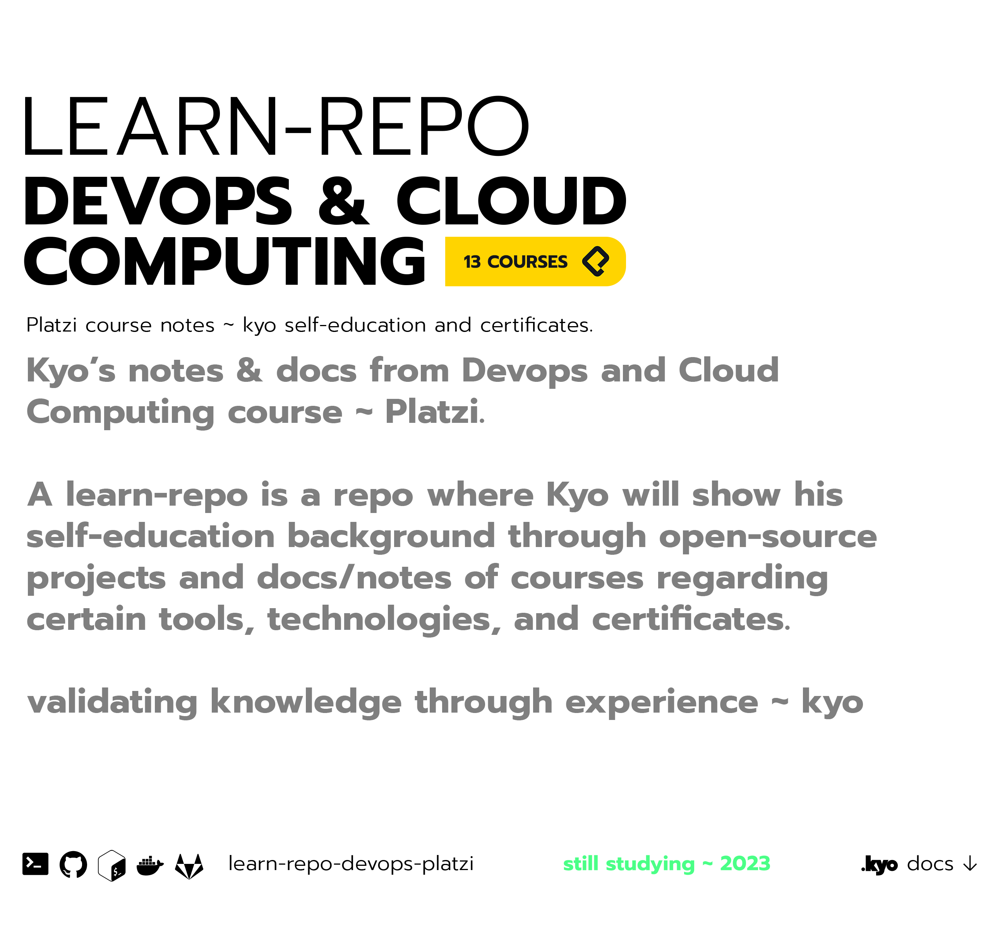

 
<a href="https://www.reddit.com/user/kyonax_on"><a/>
<a href="https://twitter.com/kyonax_on_tech" target="_blank"><a/>
<a href="https://www.instagram.com/is.kyonax/" target="_blank"><a/>
<a href="https://www.linkedin.com/in/kyonax/" target="_blank"><a/>  

  <a id="cover" href="#cover">
    <picture>
      <source media="(prefers-color-scheme: dark)" srcset="github/dark.png">
      
    </picture>
  </a>

# Table of Contents
- [Summary](#summary)
- [Curriculum](#curriculum)

# Summary
This `learn-repo` is a **documentation about the self-education course in cloud computing** taken in the **Platzi's DevOps y Cloud Computing Course** complementing it with open source projects using the technologies learned, with the mission to create an educational background to support or validate the knowledge and experience with the technologies and tools dedicated to **Cloud Computing.**

This repo is NOT replacing or transcribing any information that you can find in the actual course [Platzi DevOps y Cloud Computing](https://platzi.com/escuela/devops-cloud/), the repo is just a curriculum to show what I learned in the Platzi course, and to show what I can build with the technologies learned in it.

**Organization**. Course education structure:
- *Intro DevOps y Cloud Computing*
- *Specialization*
- *Special Certifications*
- *Cybersecurity*
- *Complementary Skills*

# Curriculum
**Curriculum version**: `0.1`
- [Intro DevOps & Cloud Computing](#intro-devops-&-cloud-computing)
  - [DevOps](#devops)

## Intro DevOps & Cloud Computing
In this path, you will learn about server administration and the main tools used in DevOps to scale your application quickly and securely.

### DevOps
Learn about the key tools for automating your processes and deploying your application.
